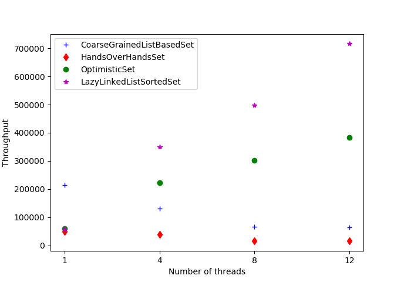

# Java Implementations

## Hand-over-Hand Algorithm

```Java
/**
 * Implementation of the fine grained lock based set.
 * To go through the linked list underlying the set, lock only two nodes at any moment.
 */
public class HandsOverHandsSet extends AbstractCompositionalIntSet {
    private class Node {
        public int key;
        public Node next = null;
        // each node can be locked individually
        private Lock lock = new ReentrantLock();

        Node(int item) {
            key = item;
        }

        void lock(){
            this.lock.lock();
        }

        void unlock(){
            this.lock.unlock();
        }
    }


    // sentinel nodes
    private Node head;
    private Node tail;

    public HandsOverHandsSet(){
        head = new Node(Integer.MIN_VALUE);
        tail = new Node(Integer.MAX_VALUE);
        head.next = tail;
    }


    /**
     * Add an element to the set.
     * If the given element is already in the set, it is not added (no duplicates in a set)
     * @param x the element to add
     * @return a boolean indicating if the element were added
     */
    @Override
    public boolean addInt(int x) {
        head.lock();
        Node pred = head;
        try {
            Node curr = pred.next;
            curr.lock();
            try {
                // go through the list and look for where to insert value
                // lock only two nodes at a time
                while(curr.key < x){
                    pred.unlock();
                    pred=curr;
                    curr=curr.next;
                    curr.lock();
                }
                // the element is already in the set
                if(curr.key == x){
                    return false;
                }
                // insert the element
                Node newNode = new Node(x);
                pred.next = newNode;
                newNode.next=curr;
                return true;
            } finally {
                // realease the locks
                curr.unlock();
            }
        } finally {
            pred.unlock();
        }
    }


    /**
     * Remove the given element from the set
     * @param x The element to remove
     * @return a boolean indicating if the element where found and removed
     */
    @Override
    public boolean removeInt(int x) {
        head.lock();
        Node pred = head;
        try {
            Node curr = pred.next;
            curr.lock();
            try {
                // go through the list and look for the value to be removed
                // lock only two nodes at a time
                while(curr.key < x){
                    pred.unlock();
                    pred=curr;
                    curr=curr.next;
                    curr.lock();
                }
                // the element is  not in the set
                if(curr.key != x) {
                    return false;
                }
                // remove the element
                pred.next = curr.next;
                return true;
            } finally {
                // release the locks
                curr.unlock();
            }
        } finally {
            pred.unlock();
        }
    }


    /**
     * Check whether a element is in the set
     * @param x the element to check the presence of
     * @return a boolean indicating if the element is in the set
     */
    @Override
    public boolean containsInt(int x) {
        head.lock();
        Node pred = head;
        try {
            Node curr = pred.next;
            curr.lock();
            try {
                // go through the list and look for the value
                // lock only two nodes at a time
                while(curr.key < x){
                    pred.unlock();
                    pred=curr;
                    curr=curr.next;
                    curr.lock();
                }
                return curr.key == x;
            } finally {
                // release locks
                curr.unlock();
            }
        } finally {
            pred.unlock();
        }
    }
}
```
\newpage

## Optimistic Algorithm

```Java
/**
 * Implementation of the optimistic lock based algorithm
 * Go through the underlying linked list a first time without lock before
 * locking and validating the nodes
 */
 public class OptimisticSet extends AbstractCompositionalIntSet {
    private class Node {
        public int key;
        public volatile Node next = null;
        // each lock can be locked individually
        private Lock lock = new ReentrantLock();

        Node(int item) {
            key = item;
        }

        void lock(){
            lock.lock();
        }

        void unlock(){
            lock.unlock();
        }
    }

    
    // sentinel nodes
    private Node head;
    private Node tail;

    public OptimisticSet(){
        head = new Node(Integer.MIN_VALUE);
        tail = new Node(Integer.MAX_VALUE);
        head.next = tail;
    }


    /**
     * Check whether the nodes are still accessible and are successor from one another
     * @param pred the node that must be preceding pred
     * @param curr the node that must be succeeding curr
     * @return a boolean indicating if the nodes are still accessible and are successor from one another
     */
    private boolean validate(Node pred, Node curr){
        Node node = head;
        while(node.key < pred.key){
            node = node.next;
        }
        return node == pred && pred.next == curr;
    }


    /**
     * Add an element to the set.
     * If the given element is already in the set, it is not added (no duplicates in a set)
     * @param x the element to add
     * @return a boolean indicating if the element were added
     */
    @Override
    public boolean addInt(int x) {
        // go through the list a first time without locks
        while (true) {
            Node pred = head;
            Node curr = pred.next;
            while(curr.key < x){
                pred = curr;
                curr = curr.next;
            }
            // lock the located elements
            pred.lock();
            curr.lock();
            try {
                // validate the nodes
                if(validate(pred, curr)){
                    // update if needed
                    if(curr.key == x){
                        return false;
                    }
                    Node newNode = new Node(x);
                    pred.next = newNode;
                    newNode.next=curr;
                    return true;
                }
            } finally {
                // release the locks
                pred.unlock();
                curr.unlock();
            }
        }
    }


    /**
     * Remove the given element from the set
     * @param x The element to remove
     * @return a boolean indicating if the element where found and removed
     */
    @Override
    public boolean removeInt(int x) {
        // go through the list a first time without locks
        while (true) {
            Node pred = head;
            Node curr = pred.next;
            while(curr.key < x){
                pred = curr;
                curr = curr.next;
            }
            // lock the located elements
            pred.lock();
            curr.lock();
            try {
                // validate the nodes
                if(validate(pred, curr)){
                    // update if needed
                    if(curr.key != x) {
                        return false;
                    }
                    pred.next = curr.next;
                    return true;
                }
            } finally {
                // release the locks
                pred.unlock();
                curr.unlock();
            }
        }
    }


    /**
     * Check whether a element is in the set
     * @param x the element to check the presence of
     * @return a boolean indicating if the element is in the set
     */
    @Override
    public boolean containsInt(int x) {
        // go through the list a first time without locks
        while (true) {
            Node pred = head;
            Node curr = pred.next;
            while(curr.key < x){
                pred = curr;
                curr = curr.next;
            }
            // lock the located elements
            pred.lock();
            curr.lock();
            try {
                // validate the nodes
                if(validate(pred, curr)){
                    return curr.key == x;
                }
            } finally {
                // release the locks
                pred.unlock();
                curr.unlock();
            }
        }
    }
}
```

\newpage

# Proofs of the Algorithms

## Hand-over-Hand Algorithm

### Linearizability

For both *remove*, *insert* and *contains* operation, let us consider the moments when the locks are taken as linearization points.
\newline
As *pred* and *curr* are locked during the update phase, they cannot be removed or altered, and then remain reachable until the locks are released. Thus, the structure of the list is preserved and the sequential specification of the set is respected.

### Deadlock freedom

We remark that the locks are acquired in ascending order of the keys. Thus, the process with the highest item locked will be able to make progress, either by updating the nodes if it found the right ones, or by pursuing the traversal as none of the following nodes is locked.

## Optimistic Algorithm

### Linearizability

We can choose the moment when the nodes have been locked and validated as the linearization point for any operation.
Then, as in the hand over hand algorithm, the *pred* and *curr* nodes being protected during the update, and as they are valid before the update, no operation can be interfering during the update and thus, the consistency and the sequential specification of the set are not violated.

### Deadlock freedom

Any process is able to make progress during the wait-free traversal step. Then, if the nodes that where found couldn't be locked or validated, it means that another process is or has been able to make progress. Hence the deadlock freedom.

\newpage

# Performance tests

## Graph depicting the throughput as a function of the number of threads for the four algorithms, with list size 100 and update ratio 10



## Graphs depicting for each algorithm the throughput as a function of the number of threads, varying the update ratio, for the list size 1000


\newline

\newline

\newline

\newline

## System details of the machine (lame10)

